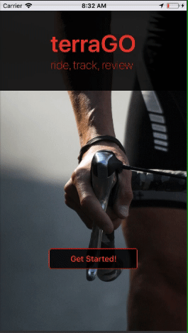
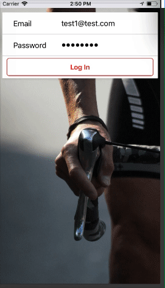
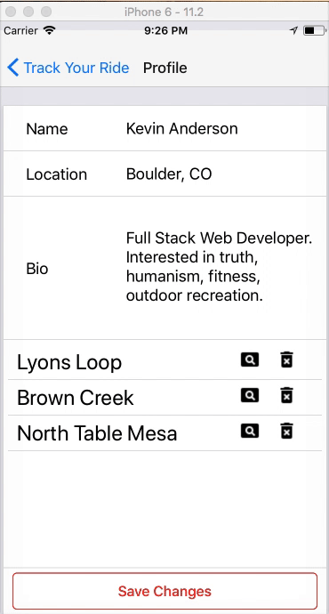
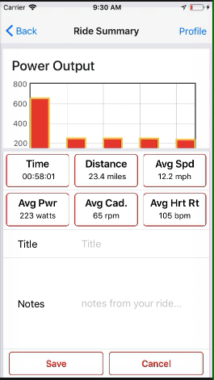

# Title:  terraGO

## Description
Mobile app for tracking cycling ride data that is simple and focused [link to the live demo](#).

### Features
- [x] **simple login/create**: User can create an account OR login just by entering in their email and password
- [ ] **pending feature: O Auth Login**: User Can login by clicking the google or facebook login icons

### ScreenShots

## Context
### Motivation
There are many apps out there already to track your cycling.  However, most are heavy/try to do too much with complicated user interfaces.  terraGO is super simple from the login to the one click start and 0 minute learning curve.  terraGO is beautiful in its simplicity.

I am a biking enthusiast and found the current app choices were all to one size fits all types.  

I picked React-Native so the app would be available to both iOS and Android from a single code base, making it easier to scale and maintain.

### Personas
I envision people that enjoy competitive biking but also want to keep the experience simple and frustration free using terraGO.  It solves the problem of being able to track ride and stats without having to waste time learning to use the app.  

## Technical Specs

- spec one: React-Native
- spec two: Redux
- spec three: Firebase
- spec four: Flot.js
- spec five: Node.js
- spec six: MongoDB
- spec seven: Heroku
- spec eight: React-Native-Maps / Google maps
- spec nine: Express
- spec ten: mLab
- spec eleven: Mongoose

## License
no license required.
